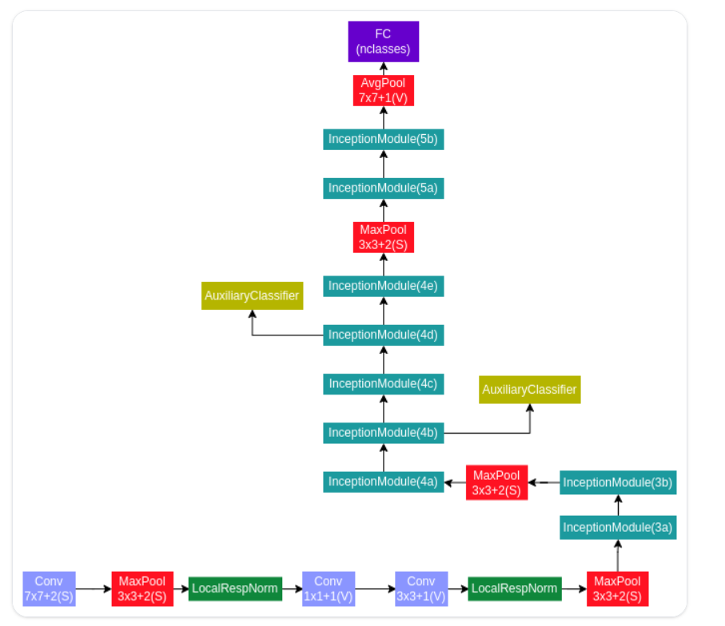

### GoogleNet (Inception v1) Architecture

The GoogleNet (Inception v1) architecture is a deep convolutional neural network that introduced the **Inception module**, allowing multi-scale feature extraction at each layer. The network has **22 layers** and is built primarily with convolutional layers, pooling layers, and inception modules.

---

### Key Features of the Architecture:

1. **Inception Modules**:
   - Each module performs convolutions with different kernel sizes (1x1, 3x3, and 5x5) in parallel, along with **max-pooling**. The outputs are concatenated to form the next layer's input.
   - **1x1 convolutions** are used before larger filters (3x3, 5x5) for **dimensionality reduction**, reducing computational complexity.

2. **Global Average Pooling (GAP)**:
   - Replaces fully connected layers at the end with **Global Average Pooling**, significantly reducing the number of parameters.
   - GAP averages the entire feature map into a single number per feature map channel.

3. **Auxiliary Classifiers**:
   - Two auxiliary classifiers are added at intermediate layers to provide additional gradient signals, helping to mitigate the vanishing gradient problem.
   - These auxiliary classifiers are used during training but discarded during inference.

4. **Final Layer**:
   - The final layer consists of a **softmax classifier** for predicting the class probabilities.

---

### Architectural Design:

- **Input**: $ 224 \times 224 $ RGB image
- **Convolution**: 7x7, 64 filters, stride 2
- **Max Pooling**: 3x3, stride 2
- **Convolution**: 1x1, 64 filters
- **Convolution**: 3x3, 192 filters
- **Max Pooling**: 3x3, stride 2

Then, multiple **Inception modules** (each containing 1x1, 3x3, 5x5 convolutions, and pooling) are stacked together.

- **Inception Module**: First set (mixed 1x1, 3x3, 5x5 filters)
- **Max Pooling**

Followed by deeper **Inception Modules**.

- **Global Average Pooling**
- **Dropout Layer**
- **Softmax Output**

---

### Path to Architecture Image:

This provides a detailed look at the GoogleNet architecture, showcasing the multi-scale nature of the Inception modules.