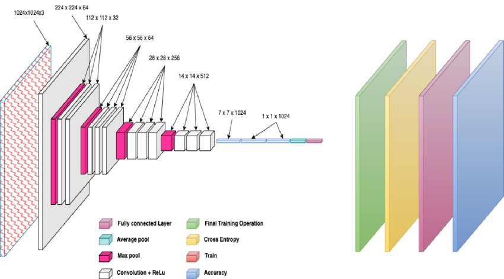

### MobileNet Architecture

**MobileNet** is a family of convolutional neural networks designed specifically for efficient execution on mobile and embedded devices. The primary focus of MobileNet is to create lightweight models that use fewer computational resources while maintaining good performance on tasks like image classification and object detection.

---

### Key Features of MobileNet:

1. **Depthwise Separable Convolutions**:
   - The core idea behind MobileNet is the use of **depthwise separable convolutions** instead of traditional convolutions. This reduces the number of parameters and computations significantly.
   - **Traditional Convolutions**: A single convolution layer applies both spatial and depth (channel-wise) filtering together.
   - **Depthwise Separable Convolutions**: Breaks this into two operations:
     1. **Depthwise Convolution**: Applies a single filter per input channel (spatial filtering).
     2. **Pointwise Convolution**: Uses a 1x1 convolution to combine the outputs of depthwise convolutions (channel filtering).
   - This decomposition drastically reduces the computational cost.

2. **Lightweight Design**:
   - MobileNet uses fewer parameters by focusing on **small convolution filters** (mostly 3x3).
   - This makes it ideal for mobile devices and embedded systems where memory and processing power are limited.

3. **Width and Resolution Multiplier**:
   - **Width Multiplier (α)**: A hyperparameter that adjusts the number of channels in each layer. It controls the trade-off between model size and accuracy.
     - For example, setting α=0.75 reduces the number of channels in every layer to 75% of the original.
   - **Resolution Multiplier (ρ)**: Another hyperparameter that reduces the input image size, making the model even more efficient but at the cost of some accuracy.

4. **Efficient Layer Structure**:
   - MobileNet consists of a series of **depthwise separable convolutions**, followed by **batch normalization** and **ReLU** activation. This pattern is repeated throughout the network.
   - It ends with **average pooling** and a fully connected layer, followed by a **softmax** classifier for output.

---

### MobileNet Architecture Design:

The architecture consists of several key blocks:

- **Initial Convolution**: 
  - First layer uses a standard convolution (3x3) with 32 filters.
  
- **Depthwise Separable Convolution Blocks**:
  - Each block contains a depthwise convolution followed by a pointwise convolution.
  - The pointwise convolution layer has 1x1 filters and is used to combine the outputs of the depthwise convolution.
  
- **ReLU** and **Batch Normalization** layers are applied after each convolution to introduce non-linearity and stabilize the learning process.

- **Average Pooling** at the end reduces the spatial dimensions before the output layer.

---

### Benefits of MobileNet:

- **Highly Efficient**: MobileNet achieves high efficiency by significantly reducing both the number of parameters and the number of computations, making it suitable for resource-constrained environments.
  
- **Customizable**: The **width multiplier** and **resolution multiplier** allow users to balance the trade-off between accuracy and efficiency based on their application requirements.
  
- **Good Performance**: Despite being lightweight, MobileNet achieves competitive accuracy compared to more computationally expensive models like VGG or ResNet.

---

### Path to MobileNet Architecture Image:   

